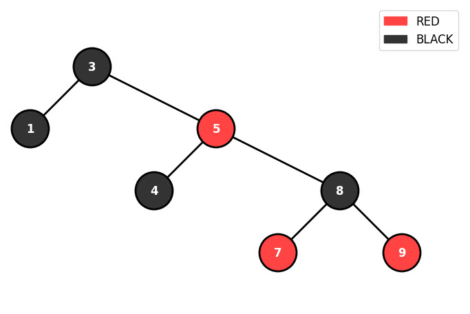

# 🌳 Red-Black Tree Visualizer

A Python implementation of Red-Black Tree with beautiful graphical visualization using Matplotlib.


## 📸 Screenshots
<div align=center>
    
</div>

## ✨ Features

- ✅ Parse tree input in parenthetic notation or comma-separated values
- ✅ Automatic Red-Black Tree construction with balancing
- ✅ Beautiful graphical visualization with color-coded nodes
- ✅ In-order traversal display
- ✅ Support for negative numbers
- ✅ Interactive matplotlib window
- ✅ Easy to use command-line interface

## 🚀 Installation

### Prerequisites

- Python 3.7 or higher
- pip package manager

### Steps

1. Clone the repository:
```bash
git clone https://github.com/serajcomputerarts/red-black-tree-visualizer.git
cd red-black-tree-visualizer
```

2. Install required packages:
```bash
pip install -r requirements.txt
```

## 💻 Usage

### Basic Usage

Run the program:
```bash
python red_black_tree.py
```

### Input Formats

The program accepts two input formats:

#### 1. Parenthetic Notation
```
(5(3(1)(4))(8(7)(9)))
```

#### 2. Comma-Separated Values
```
5,3,8,1,4,7,9
```

### Command Line Arguments

```bash
python red_black_tree.py --input "5,3,8,1,4,7,9"
python red_black_tree.py --input "5,3,8" --save output.png
```

## 📊 Examples

### Example 1: Simple Tree
**Input:**
```
5,3,8,1,4,7,9
```

### Example 2: Parenthetic Notation
**Input:**
```
(10(5(2)(7))(15(12)(20)))
```

### Example 3: Negative Numbers
**Input:**
```
-5,10,-3,20,-10,15
```

## 🔍 How It Works

### Red-Black Tree Properties

A Red-Black Tree is a self-balancing binary search tree with these properties:

1. Every node is either red or black
2. The root is always black
3. All leaves (NIL) are black
4. Red nodes cannot have red children
5. Every path from root to leaves contains the same number of black nodes

### Algorithm Steps

1. **Insertion**: Insert node as in regular BST
2. **Coloring**: Color new node as RED
3. **Fixing**: Apply rotation and recoloring to maintain properties
4. **Visualization**: Calculate positions and draw the tree


## 🛠️ Project Structure

```
red-black-tree-visualizer/
│
├── red_black_tree.py          # Main implementation
├── requirements.txt           # Python dependencies
├── README.md                  # Project documentation
├── LICENSE                    # MIT License
├── .gitignore                # Git ignore file
│
├── examples/                  # Example inputs
│   ├── example_inputs.txt
│   └── screenshots/
│       └── sample_output.png
│
└── tests/                     # Unit tests
    └── test_red_black_tree.py
```

## 🧪 Testing

Run the test suite:
```bash
python -m pytest tests/
```

Or run individual tests:
```bash
python tests/test_red_black_tree.py
```

## 🤝 Contributing

Contributions are welcome

1. Fork the repository
2. Create a new branch (`git checkout -b feature/amazing-feature`)
3. Commit your changes (`git commit -m 'Add amazing feature'`)
4. Push to the branch (`git push origin feature/amazing-feature`)
5. Open a Pull Request

## 📝 TODO

- [ ] Add save image functionality
- [ ] Implement delete operation
- [ ] Add animation for insertion steps
- [ ] Create GUI version
- [ ] Add more tree algorithms (AVL, B-Tree)
- [ ] Improve test coverage
- [ ] Add performance benchmarks


## 👤 Author

**Farhad PourReza**


## 🙏 Acknowledgments

- Inspired by classic data structures textbooks
- Matplotlib for visualization capabilities
- The open-source community


---

⭐ If you found this project helpful, please give it a star

Made with ❤️ and Python

